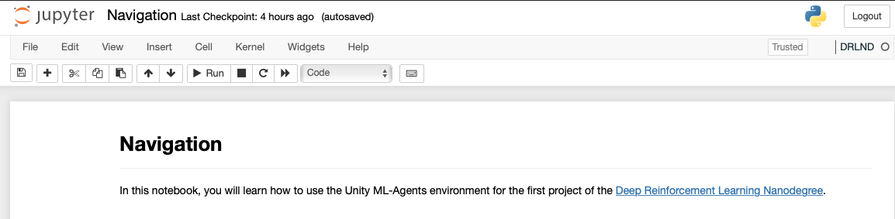

# Deep Reinforcement Learning: Navigation

[//]: # (Image References)

[image1]: https://user-images.githubusercontent.com/10624937/42135619-d90f2f28-7d12-11e8-8823-82b970a54d7e.gif "Trained Agent"

I completed this project as part of [Udacity](https://www.udacity.com)'s [Deep Reinforcement Learning Nanodegree](https://www.udacity.com/course/deep-reinforcement-learning-nanodegree--nd893).

The [Project Report](Report.md) describes the learning algorithm and results in more detail.

The file [checkpoint.pth](checkpoint.pth) contains the saved model weights of the successful agent.

The goal of this project is to train an agent to navigate in a large, square world and collect bananas.  

![Trained Agent][image1]

A reward of +1 is provided for collecting a yellow banana, and a reward of -1 is provided for collecting a blue banana.  Thus, the goal of the agent is to collect as many yellow bananas as possible while avoiding blue bananas.  

The state space has 37 dimensions and contains the agent's velocity, along with ray-based perception of objects around agent's forward direction.  Given this information, the agent has to learn how to best select actions.  Four discrete actions are available, corresponding to:
- **`0`** - move forward.
- **`1`** - move backward.
- **`2`** - turn left.
- **`3`** - turn right.

The task is episodic, and in order to solve the environment, the agent must get an average score of +13 over 100 consecutive episodes.

# Environment
Download the environment that matches your operating system from one of the links below:
- Mac OSX: [click here](https://s3-us-west-1.amazonaws.com/udacity-drlnd/P1/Banana/Banana.app.zip)
- Linux: [click here](https://s3-us-west-1.amazonaws.com/udacity-drlnd/P1/Banana/Banana_Linux.zip)
- Windows (32-bit): [click here](https://s3-us-west-1.amazonaws.com/udacity-drlnd/P1/Banana/Banana_Windows_x86.zip)
- Windows (64-bit): [click here](https://s3-us-west-1.amazonaws.com/udacity-drlnd/P1/Banana/Banana_Windows_x86_64.zip)

(_For Windows users_) Check out [this link](https://support.microsoft.com/en-us/help/827218/how-to-determine-whether-a-computer-is-running-a-32-bit-version-or-64) if you need help with determining if your computer is running a 32-bit version or 64-bit version of the Windows operating system.

(_For AWS_) If you'd like to train the agent on AWS (and have not [enabled a virtual screen](https://github.com/Unity-Technologies/ml-agents/blob/master/docs/Training-on-Amazon-Web-Service.md)), then please use [this link](https://s3-us-west-1.amazonaws.com/udacity-drlnd/P1/Banana/Banana_Linux_NoVis.zip) to obtain the environment.

I store my environment files locally, rather than in GitHub, because they are quite large. This one is 78.1MB on Mac, for example. 

Note, the project environment is similar to, but not identical to the Banana Collector environment on the [Unity ML-Agents GitHub page](https://github.com/Unity-Technologies/ml-agents/blob/master/docs/Learning-Environment-Examples.md#banana-collector).

# Create a Virtual Environment and Install Dependencies
The primary dependencies for this project are:

* [PyTorch](https://pytorch.org)
* [OpenAI Gym](https://gym.openai.com)
* [unityagents](https://pypi.org/project/unityagents/)
* [numpy](https://numpy.org)
* [matplotlib](https://matplotlib.org)

The [requirements.txt](requirements.txt) file contains all dependencies required to run the project code. You can use the [requirements.txt](requirements.txt) to create a virtual environment to run the project code.

For example, I use [Conda](https://docs.conda.io/) to create a virtual environment called `DLRND`, using the following command:

```shell
$ conda create --name DRLND --file requirements.txt
```
Activate the `DLRND` virtual environment:
```
$ conda activate DLRND
(DLRND) $ 
```

# Running the Code

The primary project code is run from the [Navigation.ipynb](Navigation.ipynb) Jupyter Notebook.


Install `ipykernel` if not already installed:
```
(DLRND) $ conda install -c anaconda ipykernel
```

Then, tell `ipykernel` about the `DLRND` conda virtual environment:
```
(DLRND) $ python -m ipykernel install --user --name=DLRND
```

Go to the root directory of your project, and run the `jupyter notebook` command:
```
(DLRND) $ jupyter notebook
```
Once Jupyter starts, select the [Navigation.ipynb](Navigation.ipynb). Go to the Kernel menu, and select the Change kernel option. From there, you should see the `DLRND` environment name listed. After you select the environment name that you want, you will see it displayed in the top right corner of the notebook, as shown here:



From there, you can follow the instructions in the notebook, and step through the notebook to see the DQN implementation in action.


The file [model.py](model.py) is imported by [dqn_agent.py](dqn_agent.py) and is used in the Agent initialized to create both the local and target networks:

```python
self.qnetwork_local = QNetwork(state_size, action_size, seed).to(device)
self.qnetwork_target = QNetwork(state_size, action_size, seed).to(device)
```

The file [dqn_agent.py](dqn_agent.py) contains the code for the `Agent` class and the `ReplayBuffer` class. This file is imported in the [Navigation.ipynb](Navigation.ipynb) notebook. The code in the notebook then creates an `Agent` object, as shown:

```python
from dqn_agent import Agent

agent = Agent(state_size=37, action_size=4, seed=68)
```

The `agent` object is used in the `dqn()` function. Training the agent is done by calling the `dqn()` function, which returns the scores:

```python
scores = dqn()
```

This results in the following ouput:

```text
Episode 100	Average Score: 0.99
Episode 200	Average Score: 4.47
Episode 300	Average Score: 7.87
Episode 400	Average Score: 10.42
Episode 500	Average Score: 12.64
Episode 511	Average Score: 13.03
Environment solved in 411 episodes!	Average Score: 13.03
```

I then plot the scores using `matplotlib`. The [project report file](Report.md) shows the output in more detail.

