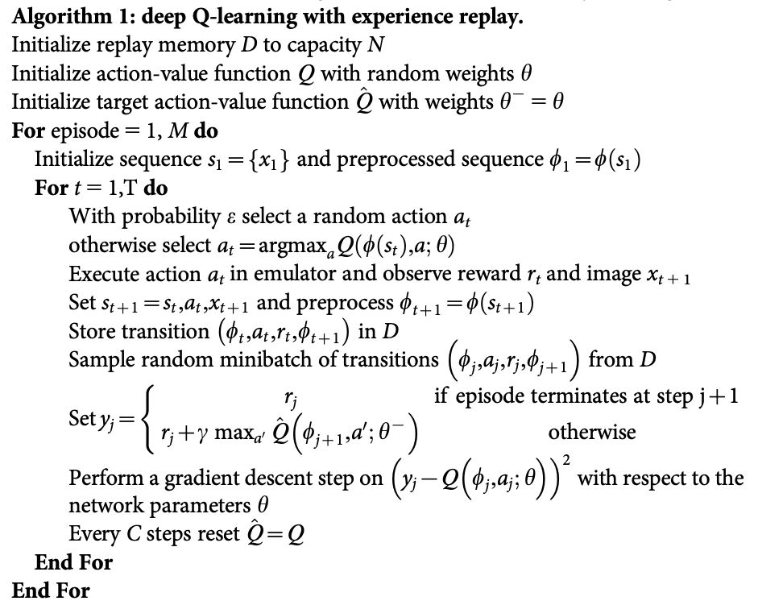
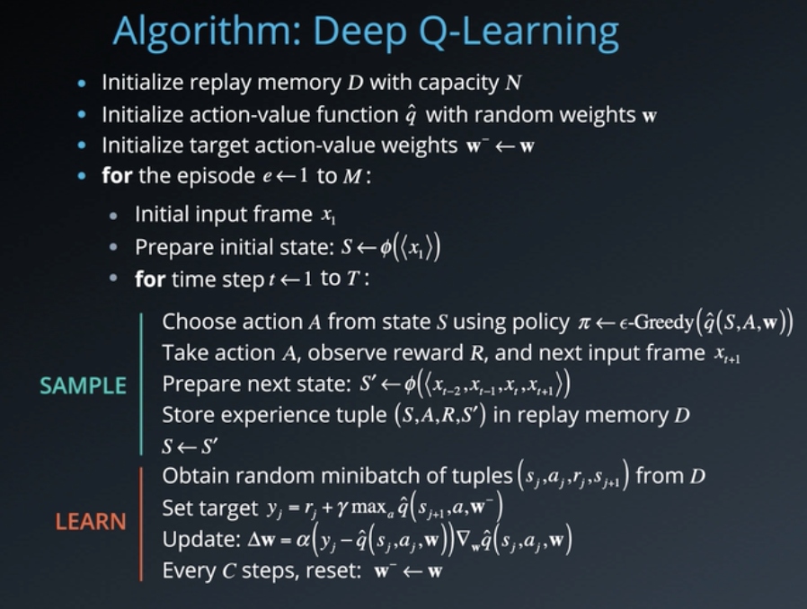
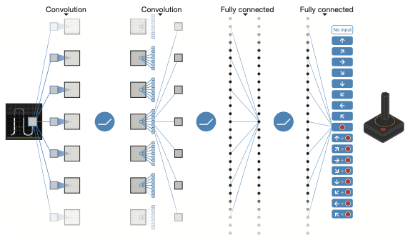
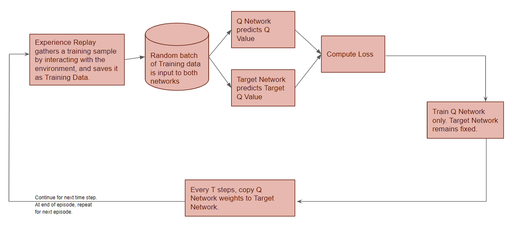
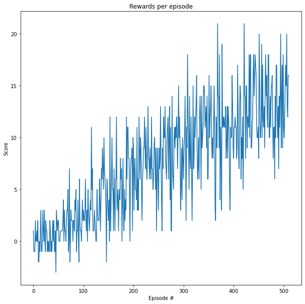

# Report

## Learning Algorithm
This section describes the learning algorithm, along with the chosen hyperparameters. It also describes the model architectures for the neural networks.

#### DQN Algorithm

[Mnih, et al (2016)](#references) introduced a reinforcement learning agent called a deep-Q network (DQN), which combines reinforcement learning with deep neural networks. The authors used DQN to show how a reinforcement learning agent can achieve a high level of performance on any of a collection of different problems without having to use different problem-specific feature sets. 

[Sutton and Barto (2018)](#references) _"To demonstrate this, they let DQN learn to play 49 different Atari 2600 video games by interacting with a game emulator. DQN learned a different policy for each of the 49 games (because the weights of its ANN were reset to random values before learning on each game), but it used the same raw input, network architecture, and parameter values (e.g., step size, discount rate, exploration parameters, and many more specific to the implementation) for all the games. DQN achieved levels of play at or beyond human level on a large fraction of these games."_

Here is the DQN algorithm from the original paper by [Mnih, et al. (2016)](#references):

 


The following view of the algorithm clearly highlights the sampling and learning steps [(Udacity)](#references):


Here is the `dqn()` function from the [Navigation](Navigation.ipynb) notebook that implements the DQN algorithm for this problem:

```python
def dqn(n_episodes=2000, max_t=1000, eps_start=1.0, eps_end=0.01, eps_decay=0.995):
    """Deep Q-Learning.
    
    Params
    ======
        n_episodes (int): maximum number of training episodes
        max_t (int): maximum number of timesteps per episode
        eps_start (float): starting value of epsilon, for epsilon-greedy action selection
        eps_end (float): minimum value of epsilon
        eps_decay (float): multiplicative factor (per episode) for decreasing epsilon
    """
    scores = []                        # list containing scores from each episode
    scores_window = deque(maxlen=100)  # last 100 scores
    eps = eps_start                    # initialize epsilon
    
    for i_episode in range(1, n_episodes+1):
        
        env_info = env.reset(train_mode=True)[brain_name]  # reset the environment
        state = env_info.vector_observations[0]            # get the current state
        
        score = 0
        for t in range(max_t):
            action = agent.act(state, eps)
            env_info = env.step(action)[brain_name]        # send the action to the environment
            next_state = env_info.vector_observations[0]   # get the next state
            reward = env_info.rewards[0]                   # get the reward
            done = env_info.local_done[0]                  # see if episode has finished
            
            agent.step(state, action, reward, next_state, done)
            state = next_state
            score += reward
            
            if done:
                break 
        
        scores_window.append(score)       # save most recent score
        scores.append(score)              # save most recent score
        eps = max(eps_end, eps_decay*eps) # decrease epsilon
        
        print('\rEpisode {}\tAverage Score: {:.2f}'.format(i_episode, np.mean(scores_window)), end="")
        
        if i_episode % 100 == 0:
            print('\rEpisode {}\tAverage Score: {:.2f}'.format(i_episode, np.mean(scores_window)))
        
        if np.mean(scores_window)>=target_average_score:
            print('\nEnvironment solved in {:d} episodes!\tAverage Score: {:.2f}'.format(i_episode-100, 
                                                                                         np.mean(scores_window)))
            torch.save(agent.qnetwork_local.state_dict(), 'checkpoint.pth')
            break
            
    return scores
```

#### Hyperparameters

Here are the hyperparameters and their values:

Hyperparameter | Value | Description
:--- | :--- | :---
BUFFER_SIZE | 1e5 | replay buffer size
BATCH_SIZE | 64 | minibatch size
GAMMA | 0.995 | discount factor
TAU | 1e-3 | for soft update of target parameters
LR | 5e-4 | learning rate
UPDATE_EVERY | 4 | how often to update the network
n_episodes | 2000 | maximum number of training episodes
max_t |  1000 | maximum number of timesteps per episode
eps_start | 1.0 | starting value of epsilon, for epsilon-greedy action selection
eps_end | 0.01 | minimum value of epsilon
eps_decay | 0.995 | multiplicative factor (per episode) for decreasing epsilon
state_size |37| dimension of each state
action_size |4| dimension of each action
seed |68| random seed
target_average_score |13.0| the agent must get an average score of +13 over 100 consecutive episodes

#### Model Architecture

The basic architecture of DQN is similar to that of a deep convolutional neural network, and is shown here [(Mnih, et al., 2016)](#references):



The following DQN workflow diagram shows the relationships between the hyperparameters and the various elements of the architecture ([Udacity](#references)):



#### Training the Model

Here is a GIF of my model training:


## Plot of Rewards
This section contains a plot of rewards per episode and illustrates that the agent is able to receive an average reward (over 100 episodes) of at least +13. 

The number of episodes needed to solve the environment is 411.



Here is the output:
```text
Episode 100	Average Score: 0.99
Episode 200	Average Score: 4.47
Episode 300	Average Score: 7.87
Episode 400	Average Score: 10.42
Episode 500	Average Score: 12.64
Episode 511	Average Score: 13.03
Environment solved in 411 episodes!	Average Score: 13.03

CPU times: user 3min 24s, sys: 30.4 s, total: 3min 54s
Wall time: 7min 54s
```

## Ideas for Future Work
Several improvements to the original Deep Q-Learning algorithm have been suggested. This section contains ideas for future work to improve the agent's performance.

**Double DQN**

Deep Q-Learning tends to overestimate action values ([Thrun, et al, 1993](#references)).  Double Q-Learning has been shown to work well in practice to help with this. [van Hasselt, et al (2015)](#references) propose a specific adaptation to the DQN algorithm and show that the resulting algorithm not only reduces the observed overestimations, but that this also leads to much better performance on several games.

**Prioritized Experience Replay**

Deep Q-Learning samples experience transitions *uniformly* from a replay memory. Prioritized experienced replay is based on the idea that the agent can learn more effectively from some transitions than from others, and the more important transitions should be sampled with higher probability ([Schaul, et al., 2015](#references)).

**Dueling DQN**

Currently, in order to determine which states are (or are not) valuable, we have to estimate the corresponding action values *for each action*. However, by replacing the traditional Deep Q-Network (DQN) architecture with a  [dueling architecture](https://arxiv.org/abs/1511.06581) , we can assess the value of each state, without having to learn the effect of each action.

**Learning from multi-step bootstrap targets**

[Mnih, et a; (2016)](#references) proposed a framework for deep reinforcement learning that uses asynchronous gradient descent for optimization of deep neural network controllers. They show show that parallel actor-learners have a stabilizing effect on training, and that asynchronous actor-critic succeeds on a wide variety of continuous motor control problems as well as on a new task of navigating random 3D mazes using a visual input.

**Distributional DQN**

[Bellemare, et al (2017)](#references) argue for the fundamental importance of the value distribution: the distribution of the random return received by a reinforcement learning agent. 

**Noisy DQN**

[Fortunato, et al (2017)](#references) introduce NoisyNet, a deep reinforcement learning agent with parametric noise added to its weights, and show that the induced stochasticity of the agent's policy can be used to aid efficient exploration.

## References
* Mnih, V., Kavukcuoglu, K., Silver, D., Rusu, A.A., Veness, J., Bellemare, M.G., Graves, A., Riedmiller, M., Fidjeland, A.K., Ostrovski, G. and Petersen, S., 2015. _Human-level control through deep reinforcement learning_. nature, 518(7540), pp.529-533.
* Sutton, R.S. and Barto, A.G., 2018. _Reinforcement learning: An introduction_. MIT press.
* Miguel Morales, 2020. _Grokking Deep Reinforcement Learning_. Manning Publications.
* Alexander Zai, Brandon Brown, 2020. _Deep Reinforcement Learning in Action_. Manning Publications.
* Udacity, 2021. [Deep Reinforcement Learning Nanodegree](https://www.udacity.com/course/deep-reinforcement-learning-nanodegree--nd893).
* Van Hasselt, H., Guez, A. and Silver, D., 2016, March. _Deep reinforcement learning with double q-learning_. In Proceedings of the AAAI conference on artificial intelligence (Vol. 30, No. 1).
* Thrun, S. and Schwartz, A., 1993, December. _Issues in using function approximation for reinforcement learning_. In Proceedings of the Fourth Connectionist Models Summer School (pp. 255-263).
* Schaul, T., Quan, J., Antonoglou, I. and Silver, D., 2015. _Prioritized experience replay_. arXiv preprint arXiv:1511.05952.
Vancouver
* Mnih, V., Badia, A.P., Mirza, M., Graves, A., Lillicrap, T., Harley, T., Silver, D. and Kavukcuoglu, K., 2016, June. _Asynchronous methods for deep reinforcement learning_. In International conference on machine learning (pp. 1928-1937). PMLR.
* Bellemare, M.G., Dabney, W. and Munos, R., 2017, July. _A distributional perspective on reinforcement learning_. In International Conference on Machine Learning (pp. 449-458). PMLR.
* Fortunato, M., Azar, M.G., Piot, B., Menick, J., Osband, I., Graves, A., Mnih, V., Munos, R., Hassabis, D., Pietquin, O. and Blundell, C., 2017. _Noisy networks for exploration_. arXiv preprint arXiv:1706.10295.